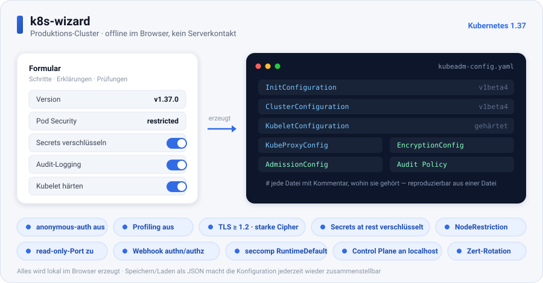

# k8s-wizard

Ein **Kubernetes-YAML-Assistent, der komplett offline im Browser läuft** — kein
Server, kein Build, keine Abhängigkeiten. Du öffnest eine Datei, klickst dich durch
ein Formular und bekommst rechts live das fertige, validierte Manifest. Zweisprachig
(DE/EN), mit Erklärungen zu jedem Feld und eingebauten Prüfungen, die typische
Produktionsfehler abfangen, bevor sie auf dem Cluster landen.



## Starten

```bash
# Repo klonen und einfach die Datei im Browser öffnen
open index.html      # macOS
xdg-open index.html  # Linux
```

Es wird nichts nach außen gesendet (`offline · kein serverkontakt`). Alles entsteht
lokal im Browser.

## Was der Assistent kann

- **Einzelne Ressourcen bauen:** Deployment, StatefulSet, Service, Ingress,
  ConfigMap, Secret (Klartext, SealedSecret oder ExternalSecret), Job, CronJob,
  PersistentVolumeClaim, NetworkPolicy, PodDisruptionBudget, HorizontalPodAutoscaler,
  RBAC (ServiceAccount + Role/ClusterRole + Binding) und Namespace.
- **Komplette Anwendung** in einem Durchgang: Namespace → ConfigMap → Secret → PVC →
  Deployment/StatefulSet → Service → Ingress, inklusive HPA, PDB und NetworkPolicy.
- **Produktions-Cluster (kubeadm)** — siehe unten.
- Live-YAML mit Syntax-Hervorhebung, **Validierung** (Fehler und Warnungen mit Sprung
  zum betroffenen Feld), passende `kubectl`-Befehle, Markdown-Doku-Export sowie
  **Speichern/Laden** der gesamten Konfiguration als JSON.
- Ein `kubectl`-Nachschlagewerk, ein Speicher-Wiki und eine Volltextsuche über alle
  Felder und Erklärungen.

## Produktions-Cluster (Kubernetes 1.37)

Die Vorlage **„Produktions-Cluster (kubeadm)"** erzeugt aus einem Formular einen
kompletten, gehärteten Konfigurationssatz für **Kubernetes 1.37** — als ein einziges
Mehrfach-Dokument-Manifest, aus dem sich derselbe Cluster jederzeit wieder aufbauen
lässt.

**Erzeugte Dokumente** (kubeadm-API `v1beta4` plus Komponenten-Konfigurationen):

| Dokument | Zweck |
|---|---|
| `InitConfiguration` | Runtime-Socket, übersprungene Phasen |
| `ClusterConfiguration` | Version, Netze, API-Server-/Controller-/Scheduler-Flags, etcd |
| `KubeletConfiguration` | gehärtete Kubelet-Einstellungen für jeden Node |
| `KubeProxyConfiguration` | iptables/ipvs (oder weggelassen bei kube-proxy-less CNI) |
| `EncryptionConfiguration` | Secrets verschlüsselt in etcd (at rest) |
| `AdmissionConfiguration` | Pod Security Standards (Standard: `restricted`) |
| `Policy` (audit.k8s.io) | Audit-Regeln, die Secret-Inhalte bewusst aussparen |

**Sicherheit, die ein Produktionscluster braucht** — jeder Schalter setzt konkrete
Flags:

- API-Server: anonyme Anfragen aus, Profiling aus, Audit-Logging, TLS-Mindestversion
  1.2 mit starken Cipher-Suiten, Verschlüsselung at rest, ServiceAccount-Token-Prüfung
  gegen etcd, `NodeRestriction` und Admission-Config-Datei.
- Pod Security Standards clusterweit als Default (`restricted`, mit ausgenommenen
  Namespaces wie `kube-system`).
- Controller-Manager und Scheduler nur an `127.0.0.1`, eigene ServiceAccount-Identitäten.
- Kubelet gehärtet: unauthentifizierter Read-only-Port geschlossen, Webhook-Authn/Authz,
  `seccomp RuntimeDefault` als Standard, Zertifikatsrotation, reservierte
  System-Ressourcen.

**Reproduzierbar — „wieder zusammenstellbar":**

- Alles liegt in **einer** Datei; jedes Nebendokument trägt einen Kommentar mit seinem
  Zielpfad (z. B. `# /etc/kubernetes/enc/encryption-config.yaml`).
- Eine feste Patch-Version (`v1.37.0`) statt `v1.37` sorgt dafür, dass ein späterer
  Rebuild bit-genau dasselbe ergibt.
- Die Befehlsleiste zeigt genau die passenden Schritte: Schlüssel erzeugen →
  `kubeadm init --config …` → kubeconfig einrichten → `kubeadm token create
  --print-join-command`.
- Über **Speichern/Laden** wird die komplette Eingabe als JSON abgelegt und lässt sich
  1:1 wiederherstellen.

> Hinweis: kubeadm installiert kein CNI — nach dem `init` muss ein Netzwerk-Plugin
> (Cilium, Calico, …) angewandt werden, sonst bleiben die Nodes `NotReady`. Der
> EncryptionConfiguration liegt bewusst ein Platzhalterschlüssel bei; er muss vor dem
> `init` durch 32 zufällige Bytes ersetzt werden (`head -c 32 /dev/urandom | base64`).
> Der Assistent warnt, solange der Platzhalter noch drinsteht.

## Tests

Der Assistent bringt eine eingebaute Selbsttest-Suite mit (Schaltfläche **tests** in
der YAML-Leiste), die den YAML-Emitter, die Validierung und alle Build-Funktionen
prüft — darunter der Aufbau und die Härtung des Produktions-Clusters.
