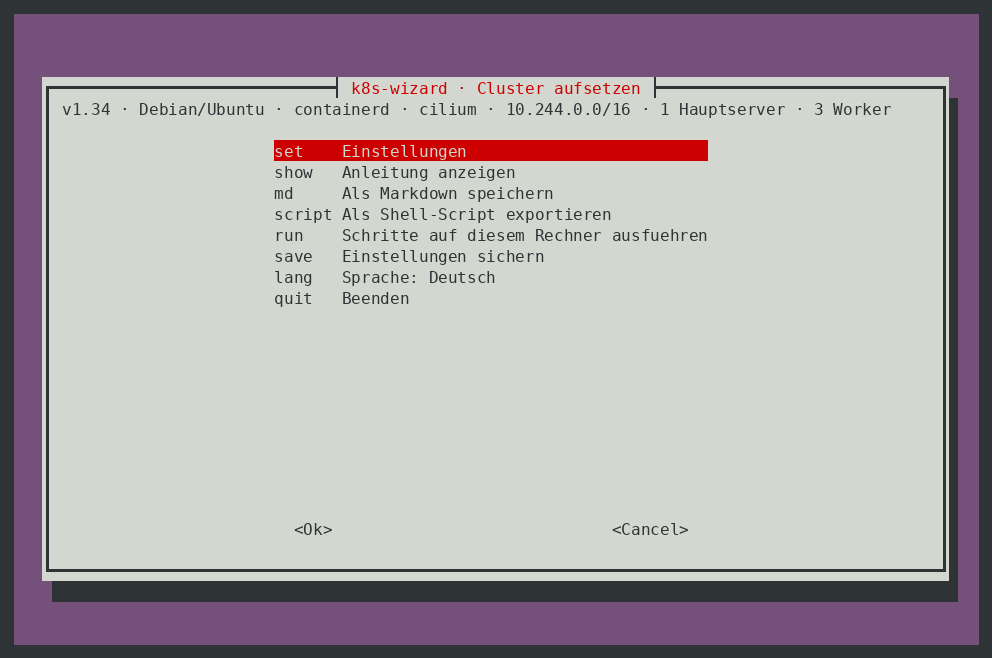
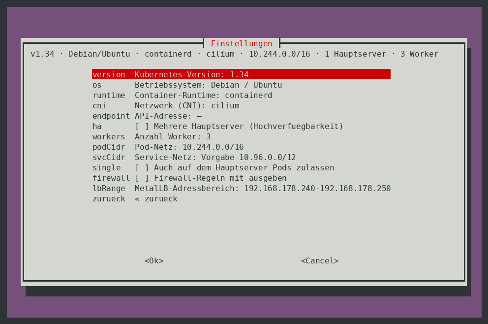
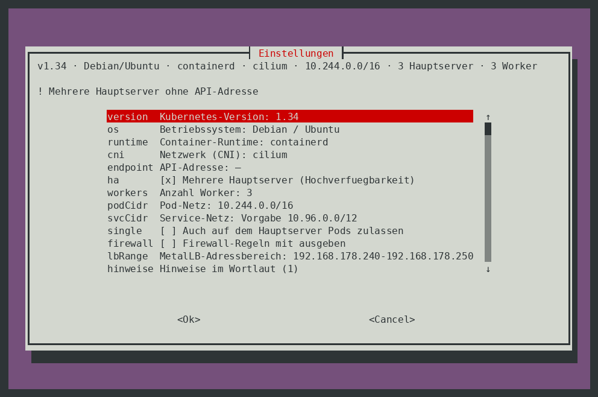
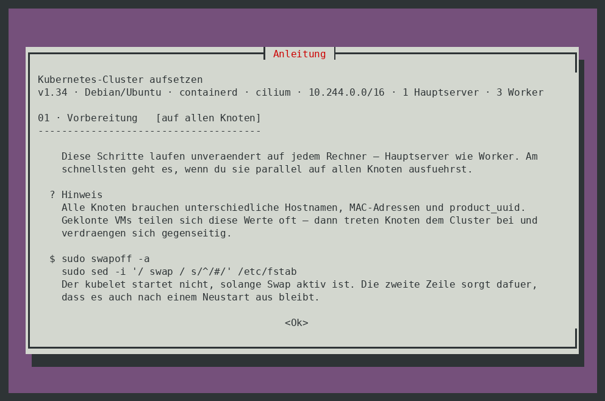
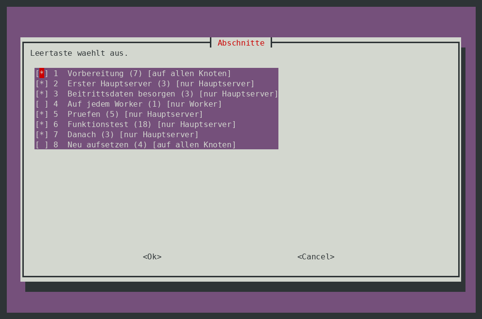
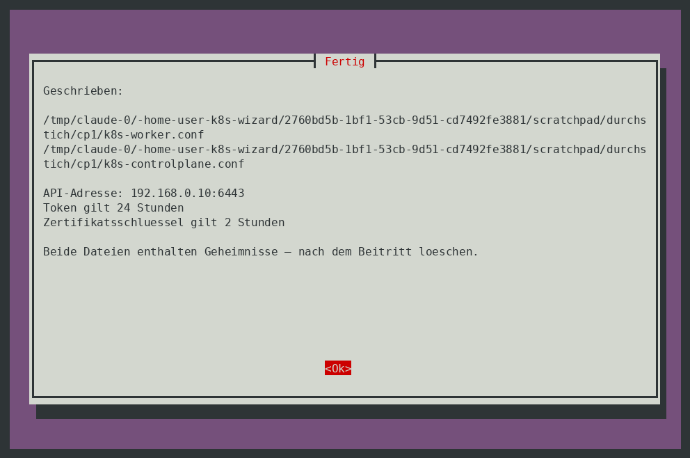
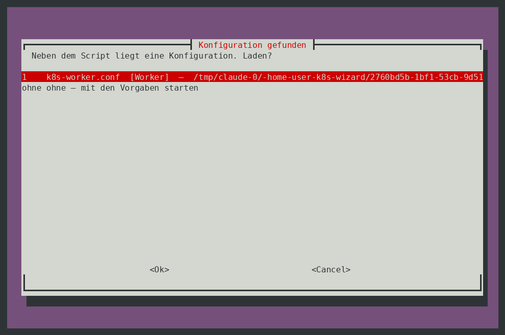
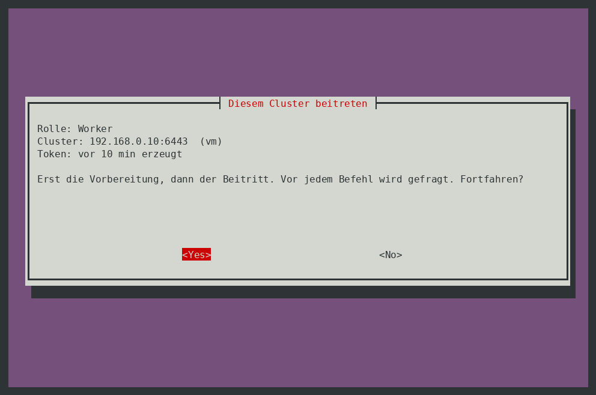
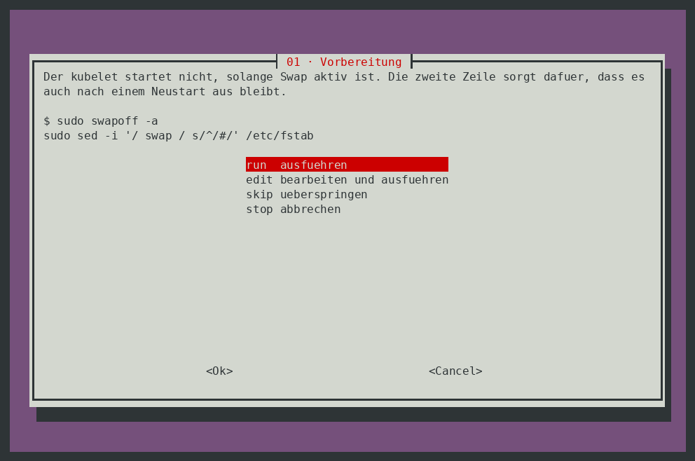

# k8s-wizard

Offline-Wizard für Kubernetes-Manifeste. `index.html` im Browser öffnen — kein
Server, kein Build, keine Abhängigkeiten.

## cluster-setup.sh

Das Panel **Cluster** gibt es auch fürs Terminal: `cluster-setup.sh` stellt
dieselben Optionen mit whiptail oder dialog zur Auswahl und erzeugt daraus
dieselbe Anleitung.



```sh
./cluster-setup.sh                 # Oberfläche
./cluster-setup.sh --selftest      # Selbsttests
./cluster-setup.sh --set cni=calico --set ha=1 --set endpoint=k8s-api.firma.de --md k8s.md
```

### Einstellungen

Dieselben zwölf Felder wie in der WebUI. Die Kopfzeile zeigt jederzeit, was
gerade eingestellt ist.



Passt etwas nicht zusammen, steht es als eine Zeile über der Liste — ein zu
kleines Pod-Netz, ein Pod-Netz aus dem üblichen Heimnetzbereich, mehrere
Hauptserver ohne feste API-Adresse. Den Wortlaut gibt es hinter dem Eintrag
*Hinweise im Wortlaut*, der nur erscheint, wenn es etwas zu sagen gibt.



### Anleitung, Markdown, Script

Die Anleitung selbst — Abschnitt für Abschnitt, jeder mit der Angabe, auf
welchem Rechner er auszuführen ist:



**Als Markdown speichern** liefert dieselbe Datei wie der Knopf in der WebUI.
**Als Shell-Script exportieren** stellt aus den gewählten Abschnitten ein
eigenständiges Script zusammen; die Vorauswahl richtet sich nach der Rolle des
Rechners. Befehle mit Platzhaltern (`<TOKEN>`, `ADRESSE-…`) werden darin nur
angezeigt, nie ausgeführt.



### Beitrittspakete: vom Hauptserver zu den anderen Knoten

Damit auf Worker und weiteren Hauptservern nichts abgetippt werden muss, holt
das Script auf dem **ersten Hauptserver** ein frisches Token, den CA-Hash und —
bei Hochverfügbarkeit — einen Zertifikatsschlüssel und schreibt sie zusammen
mit allen Einstellungen in eine Datei je Rolle:

    k8s-worker.conf         Einstellungen + Token + Hash
    k8s-controlplane.conf   dasselbe, dazu der Zertifikatsschlüssel



Beide Dateien bekommen Rechte `0600` — es sind Geheimnisse. Anschließend kann
das Script sie per `scp` auf den Zielrechner kopieren, das Script selbst kommt
dabei mit.

Auf dem Zielrechner genügt dann `./cluster-setup.sh`. Die Datei wird beim Start
gefunden und angeboten:



Danach steht im Menü **Diesem Cluster beitreten** — Vorbereitung und Beitritt in
einem Durchgang, mit den echten Werten in den Befehlen statt `<TOKEN>` und
`<HASH>`:



Zwei Dinge sind dabei bewusst so gebaut:

- Die **Markdown-Ausgabe maskiert** Token, Hash und Schlüssel wieder zu
  `<TOKEN>`, `<HASH>` und `<KEY>`. Die Anleitung darf man weitergeben, das
  Token nicht.
- Befehle, die auf einen **anderen** Rechner gehören — etwa das Erzeugen eines
  neuen Zertifikatsschlüssels auf dem ersten Hauptserver — stehen in der
  Anleitung, werden beim Beitreten aber nicht angeboten.

Das Token gilt 24 Stunden, der Zertifikatsschlüssel zwei. Das Menü zeigt, wie
alt beides ist; danach auf dem ersten Hauptserver ein neues Paket erzeugen.
Nach dem Beitritt gehört die Datei gelöscht — das Script sagt es auch.

### Auf dem Rechner ausführen

Schritt für Schritt, mit Befehl und Begründung vor jeder Entscheidung.
Mehrzeilige Befehle lassen sich vorher Zeile für Zeile bearbeiten; die Ausgabe
und der Rückgabewert stehen danach im Bild.



### Ohne whiptail

Fehlen whiptail und dialog, fällt das Script auf reine Textabfragen zurück
(`--no-tui` erzwingt das), womit sich der Ablauf auch skripten lässt:

```sh
printf 'set\ncni\ncalico\nzurueck\nmd\nk8s.md\nquit\n' | ./cluster-setup.sh --no-tui
```
