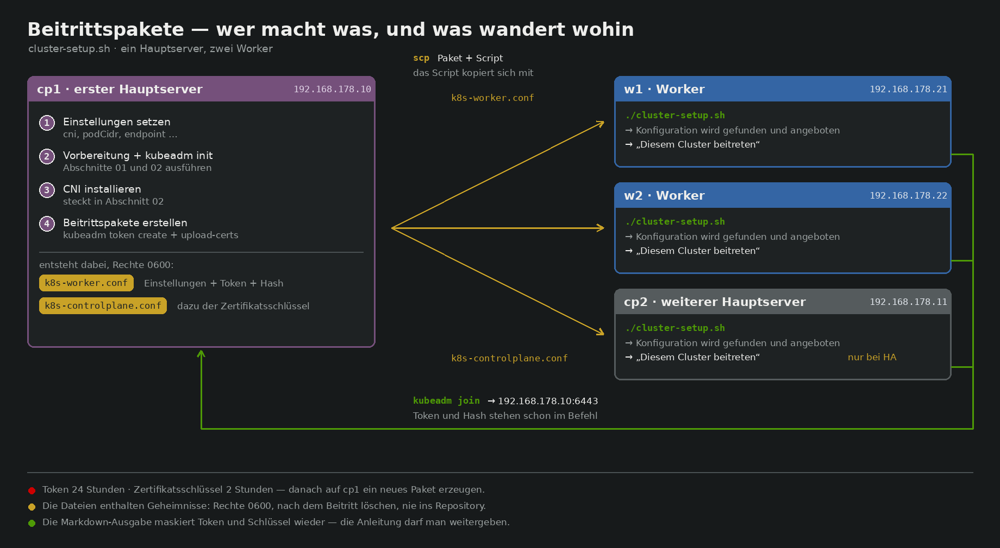

# Beispiel: drei Knoten im Heimnetz

Ein durchgerechneter Durchgang mit `cluster-setup.sh` — von drei frisch
installierten Maschinen bis zum Cluster, in dem alle drei `Ready` sind.



## Ausgangslage

| Rolle | Name | Adresse | Betriebssystem |
|---|---|---|---|
| erster Hauptserver | `cp1` | 192.168.178.10 | Debian 12 oder Ubuntu 24.04 |
| Worker | `w1` | 192.168.178.21 | dasselbe |
| Worker | `w2` | 192.168.178.22 | dasselbe |

Dazu die Entscheidungen, die vorher feststehen müssen — zwei davon lassen sich
später nicht mehr ändern:

- **Pod-Netz** `10.244.0.0/16`. Muss sich mit dem Heimnetz (192.168.178.0/24)
  nicht überschneiden, tut es hier auch nicht. **Nachträglich nicht änderbar.**
- **API-Adresse** `k8s.lan`. Ein Name statt einer IP, damit er später auf einen
  Lastverteiler zeigen kann, ohne Zertifikate neu auszustellen.
  **Nachträglich nur mit Neuaufsetzen änderbar.**
- **MetalLB-Bereich** `192.168.178.240-192.168.178.250`. Muss außerhalb dessen
  liegen, was der Router per DHCP vergibt.

Auf **allen drei** Maschinen zuerst den Namen auflösbar machen, solange es
keinen DNS-Eintrag gibt:

```sh
echo '192.168.178.10 k8s.lan' | sudo tee -a /etc/hosts
```

## 1 · Script auf cp1 bringen

```sh
git clone https://github.com/bastiangrotehamburg-creator/k8s-wizard.git
cd k8s-wizard
./cluster-setup.sh --selftest    # 56 Zusicherungen, alle grün
```

Fehlt whiptail, einmal nachinstallieren — sonst fragt das Script im Klartext:

```sh
sudo apt-get install -y whiptail    # Debian/Ubuntu
sudo dnf install -y newt            # RHEL/Rocky
```

## 2 · Einstellungen setzen

Entweder im Menü unter **Einstellungen**, oder gleich beim Aufruf:

```sh
./cluster-setup.sh \
  --set cni=cilium \
  --set podCidr=10.244.0.0/16 \
  --set endpoint=k8s.lan \
  --set workers=2 \
  --set lbRange=192.168.178.240-192.168.178.250
```

Die Kopfzeile des Menüs zeigt danach `v1.34 · Debian/Ubuntu · containerd ·
cilium · 10.244.0.0/16 · 1 Hauptserver · 2 Worker · k8s.lan`. Steht dort eine
Zeile mit `!`, stimmt etwas nicht zusammen — der Wortlaut steckt hinter
*Hinweise im Wortlaut*.

Zum Sichern **Einstellungen sichern** wählen; dann sind sie beim nächsten Start
wieder da.

## 3 · cp1 aufsetzen

**Schritte auf diesem Rechner ausführen** → Rolle **Hauptserver** → in der
Abschnittsliste nur

- `1 Vorbereitung`
- `2 Erster Hauptserver`

stehen lassen, den Rest abwählen. Dann Schritt für Schritt bestätigen. Der
Reihe nach passiert: Swap aus, Kernelmodule und sysctl, containerd mit dem
richtigen cgroup-Treiber, die Pakete aus der Quelle für v1.34, `kubeadm init`
mit `--pod-network-cidr` und `--control-plane-endpoint`, die kubeconfig ins
Benutzerverzeichnis und Cilium als CNI.

Nach `kubeadm init` prüfen — das dauert ein bis zwei Minuten, bis alles läuft:

```sh
kubectl get nodes          # cp1 muss Ready sein
kubectl get pods -A        # CoreDNS muss Running sein, nicht Pending
```

Bleibt CoreDNS in `Pending`, ist das CNI noch nicht durch. Ist cp1 dauerhaft
`NotReady`, sagt dieser Befehl im Klartext warum:

```sh
kubectl get nodes -o jsonpath='{range .items[*]}{.metadata.name}{": "}{range .status.conditions[?(@.type=="Ready")]}{.message}{end}{"\n"}{end}'
```

## 4 · Beitrittspakete erzeugen

Im Menü **Beitrittspakete für die anderen Knoten**. Das Script holt über
`kubeadm token create --print-join-command` ein frisches Token samt CA-Hash und
schreibt:

```
k8s-worker.conf    Einstellungen + api + token + hash
```

Beide Werte stehen dann auch in der Kopfzeile des Menüs, mit dem Alter des
Tokens. Danach fragt das Script, wohin es die Datei kopieren soll:

```
root@192.168.178.21
root@192.168.178.22
```

Es kopiert **Paket und Script zusammen** — auf w1 und w2 muss also vorher
nichts liegen. Nach dem Passwort fragt `scp` selbst; dafür bekommt es das
Terminal ganz, die Dialogbox verschwindet solange.

Ohne scp geht es genauso von Hand:

```sh
scp k8s-worker.conf cluster-setup.sh root@192.168.178.21:~/
```

## 5 · Worker beitreten lassen

Auf w1 (und danach genauso auf w2):

```sh
./cluster-setup.sh
```

Das Script findet `k8s-worker.conf` neben sich und bietet sie an. Nach der
Auswahl steht im Menü **Diesem Cluster beitreten [Worker]**. Der Durchgang
umfasst dieselbe Vorbereitung wie auf cp1 und danach den Beitritt — mit den
echten Werten im Befehl:

```sh
sudo kubeadm join 192.168.178.10:6443 \
  --token ab12cd.34ef56gh78ij90kl \
  --discovery-token-ca-cert-hash sha256:1f2e…
```

Nichts abzutippen, nichts nachzuschlagen. Danach die Datei löschen — sie
enthält ein gültiges Token:

```sh
rm k8s-worker.conf
```

## 6 · Nachsehen und ausprobieren

Zurück auf cp1:

```sh
kubectl get nodes -o wide
```

Erwartung: drei Zeilen, alle `Ready`. Direkt nach dem Beitritt ist `NotReady`
normal, solange Cilium seine Pods auf die neuen Knoten verteilt.

Danach lohnt der **Funktionstest** aus dem Menü (Abschnitt 6): von innen nach
außen — DNS, ein Deployment mit drei Replicas, der Service über seinen Namen,
NodePort von außen, dann MetalLB und der Ingress-Controller. Jeder Schritt
setzt den vorigen voraus; bricht einer ab, liegt die Ursache dort.

## Wenn das Token abgelaufen ist

Es gilt 24 Stunden. Danach meldet der Beitritt
`token id … is invalid or expired`. Auf cp1 einfach ein neues Paket erzeugen
und erneut kopieren — Schritt 4. Das Menü zeigt beim Laden eines Pakets, wie
alt es ist, und sagt es deutlich, wenn es zu alt ist.

## Variante: drei Hauptserver

Bei `ha=1` ändert sich zweierlei. `kubeadm init` bekommt `--upload-certs`, und
das Paket-Menü schreibt zusätzlich `k8s-controlplane.conf` mit einem
Zertifikatsschlüssel. Der Ablauf ist derselbe, mit drei Unterschieden:

- Die **API-Adresse ist zwingend** und sollte auf einen Lastverteiler oder eine
  VIP zeigen, nicht auf cp1. Zeigt sie auf eine einzelne Maschine, ist der
  Cluster trotz drei Hauptservern nicht hochverfügbar.
- Der Zertifikatsschlüssel gilt nur **zwei Stunden**. Für den zweiten und
  dritten Hauptserver also zügig arbeiten oder ein neues Paket erzeugen.
- **Drei Hauptserver, nicht zwei.** etcd braucht eine Mehrheit; mit zweien
  steht der Cluster, sobald einer ausfällt.

Reihenfolge: cp1 fertig aufsetzen, dann cp2 und cp3 mit
`k8s-controlplane.conf`, zuletzt die Worker.

## Trockenübung ohne Cluster

Den ganzen Weg kann man auf einem einzigen Rechner durchspielen, ohne
Kubernetes zu installieren — mit einem Stellvertreter für `kubeadm`:

```sh
mkdir -p /tmp/probe/bin /tmp/probe/cp1 /tmp/probe/w1
cat > /tmp/probe/bin/kubeadm <<'EOF'
#!/bin/bash
case "$*" in
  "token create --print-join-command")
    echo "kubeadm join 192.168.178.10:6443 --token ab12cd.34ef56gh78ij90 --discovery-token-ca-cert-hash sha256:1f2e3d4c5b6a";;
  "init phase upload-certs --upload-certs")
    echo "[upload-certs] Using certificate key:"; echo "aabbccddeeff00112233445566778899";;
  *) echo "kubeadm: $*"; exit 1;;
esac
EOF
chmod +x /tmp/probe/bin/kubeadm

# sudo setzt PATH zurueck und wuerde am Stellvertreter vorbeigreifen —
# fuer die Trockenuebung also auch dafuer einen.
printf '#!/bin/bash\nexec "$@"\n' > /tmp/probe/bin/sudo
chmod +x /tmp/probe/bin/sudo

export PATH=/tmp/probe/bin:$PATH

cp cluster-setup.sh /tmp/probe/cp1/
cd /tmp/probe/cp1 && ./cluster-setup.sh            # Pakete erzeugen
cp k8s-worker.conf cluster-setup.sh /tmp/probe/w1/ # „scp“
cd /tmp/probe/w1 && ./cluster-setup.sh             # Paket wird gefunden
```

Auf der Worker-Seite dann jeden Schritt mit **überspringen** durchklicken: Der
Beitrittsbefehl steht mit echten Werten da, ausgeführt wird nichts. So lässt
sich der Ablauf ansehen, bevor es an echte Maschinen geht.

Ganz ohne Tastendrücke geht es auch — erst die Pakete auf cp1, dann der
Beitritt auf w1:

```sh
cd /tmp/probe/cp1 && printf 'pkg\nj\n.\nfertig\nquit\n' | ./cluster-setup.sh --no-tui
cp k8s-worker.conf cluster-setup.sh /tmp/probe/w1/
cd /tmp/probe/w1 && printf '1\njoin\nj\nskip\nskip\nskip\nskip\nskip\nskip\nskip\nskip\nquit\n' \
  | ./cluster-setup.sh --no-tui
```

Am Ende steht der fertige Beitrittsbefehl mit eingesetzten Werten in der
Ausgabe — genau der, der auf der echten Maschine laufen würde.

## Was das Script nicht macht

- **Es installiert keinen Speicher.** Ohne StorageClass bleibt jedes
  PersistentVolumeClaim für immer `Pending`. Auf eigener Hardware kommen dafür
  Longhorn oder der local-path-provisioner in Frage.
- **Es sichert nichts.** `kubeadm reset` im Abschnitt *Neu aufsetzen* löscht auf
  einem Hauptserver etcd und damit den gesamten Clusterinhalt.
- **Es ersetzt kein Konfigurationsmanagement.** Für viele Knoten oder
  wiederholte Aufbauten sind Ansible oder kubeadm-Konfigurationsdateien der
  bessere Weg; dieses Script ist für den überschaubaren Fall gedacht, bei dem
  man jeden Schritt sehen will.
